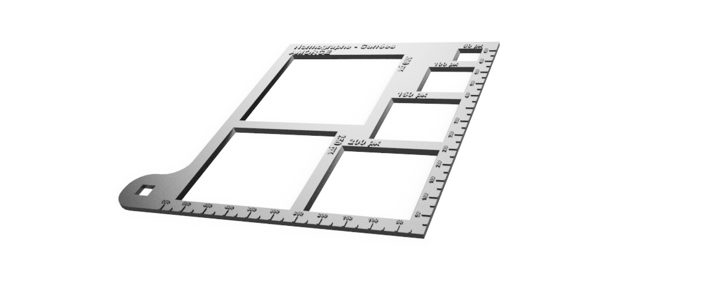
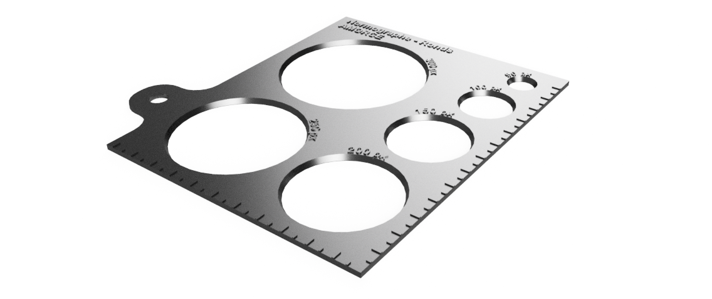

# Notes de conception
## 1/ Page
 - Je pars d'une fauille A3 qui prise au format portrait servira de base de page web
 - On placera plusieurs feuilles les une après les autres pour avoir une page déroulante.
 - La largeur d'une page A3 est de 29,7cm. 
 - partant pour un format d'écran d'ordinateur stadart (1920*1080 px), un px représente 0,18mm. 

## 2/ Normographe
### 2.1 Carrées
 - Pour commencer on va prendre des tailles de 50px à 600px avec pas de 50px. 
 - Ce qui donne des carrés de :

|Correspondance en pixel (px)|Taille en mm (écran 1920*1080 px (1 pixel ~ 0,18mm))|
|-----|-----|
|50 px|9 mm|
|100 px|18 mm|
|150 px|27 mm|
|200 px|36 mm|
|250 px|45 mm|
|300 px|54 mm|
|350 px|63 mm|
|400 px|72 mm|
|450 px|81 mm|
|500 px|90 mm|
|550 px|99 mm|
|600 px|108 mm|
 
 - Les dimentions au delà de 300px sont difficile à caser sur le normographe car trop grande. C'est pourquoi j'ai ajouté des graduations pour les dimentions plus grandes. 
 - Voilà un aperçu de ce que cela peu donner

### 2.2 Ronds
Les cercles sont réalisés aux même dimensions que les carrées.
 

### 2.3 Rectangles
Dans le web on utilise des rectangls de divers proportions. Même si toutes les dimensions se valent, il est commun d'utiliser quelques proportions courantes de photographie comme par exemple 4:3 ou 16:9. 

Dans un premier temps, j'ai fais le choix de réaliser deux normographes l'un en 16:9 et l'autre en 4:3. 

Les dimentions choisis prennent pour hauteur la même valeur que pour les carrées et les cercles. 

|Correspondance en pixel (Hauteur en px* largeur en px)|Taille en mm (écran 1920*1080 px (1 pixel ~ 0,18mm))|
|-----|-----|
|50 px * ~67 px|9 mm * 12 mm|
|100 px * ~133 px |18 mm * 24 mm|
|150 px * 200 px|27 mm * 36 mm|
|200 px * ~267 px|36 mm * 48 mm|
|250 px * ~333 px|45 mm * 60 mm|
|300 px * 400 px|54 mm * 72 mm|