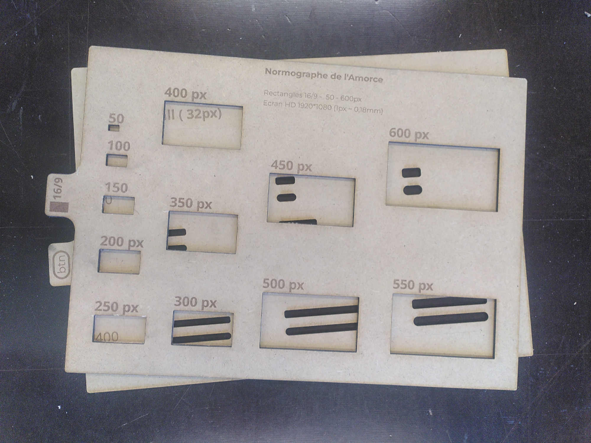

# Outils pour le maquettage web sur papier

Que vous souhaitiez réaliser vous-même votre site web ou en confier la réalisation à un prestataire extérieur. Que vous souhaitiez le réaliser en code ou en no-code, Le maquettage de votre site web est une étape cruciale pour bien définir vos besoins.

Pour y parvenir, l'équipe de l'Amorce, développe un outil de maquettage papier destiné à toutes personnes désirant travailler le visuel de son futur site web sans nécessairement avoir recours au numérique lors de cette étape. 

Le projet Amorce est une processus d'accompagnement des entrepreneur.euse.s et porteur.euse.s de projets à l'appropriation et l'autonomisation sur le web. Les outils sont délivrés en open source. Ce qui n'est pas le cas des guides d'utilisations. 

Pour nous faire intervenir, nous vous invitons à nous contacter. 

## 1. Les normographes

### 1.1 Pour quoi faire ? 
Vous avez sans doute déjà utilisé un normographe durant votre enfance. Il s'agit d'une règle généralement en plastique qui est troué de formes à différentes dimensions. Ces dimensions sont défini en cm ou en pouces. 

Dans notre cas, nous cherchons à donner la possibilité de découper des formes dont les dimensions par rapport à une feuille A3, seraient proportionnelle à ce que l'on peut voir à un écran. Les dimensions indiqués sur ces normographes sont en pixels et sont calculés par rapport à un écran de référence (indiqué en haut).

### 1.2 Matériel
**Rassembler le matériel suivant : **

|Dénomination|Notes|Quantité|Fournisseur|
|------|------|------|------|
|Planche de bois MDF 3mm|Planche de 300mm * 400mm pour chque fichier de découpe|1|Magasin de bricolage|

**Outils nécessaire :**
 - Découpeuse laser (plateau minimum 300*400mm)
 - Logiciel Inkscape
 

### 1.3 Fabrication

 - Vous trouverez les fichiers sources dans le dossier "laser-cuts" se trouvant à la racine de l'archive github.
 - Découper et graver au laser (tracés noir et bleu à graver, tracés rouge à couper)

## 2. Les gabarits de police d'écritures

Rédaction en cours

