# Des boites empilables et paramétrables

Ces boites sont conçus pour être empilables et surtout modifiable en dimensions. 
Le fichier ".f3D" permet de modifier les cotes de cette boite. 

## 1. Fabrication
### 1.2 Matériel
**Rassembler le matériel suivant : **

|Dénomination|Notes|Quantité|Fournisseur|
|------|------|--|-----|
|Planche de bois contreplaqué 5mm|Planche de 1200mm * 600mm pour chaque fichier de découpe|1|Magasin de bricolage|
|Colle à bois||1|Magasin de bricolage|

**Outils nécessaire :**
 - Découpeuse laser (plateau minimum 300*400mm)
 - Logiciel Inkscape
 - Sert-joint
 

### 1.3 Fabrication
 - Coller les charnières (pièces rondes) sur le coté du couvercle. 
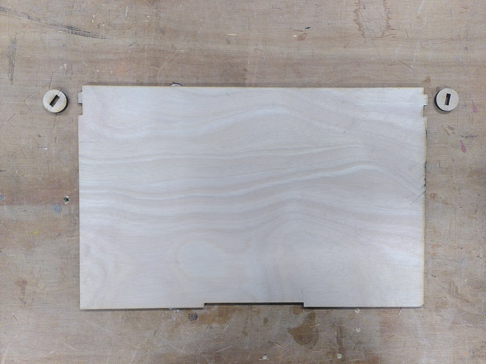

- Disposer le fond et les cloisons internes comme ceci. 

- Encoller puis coller les cloisons internes en veillant à disposer de la colles sur toutes les surfaces en contact. 
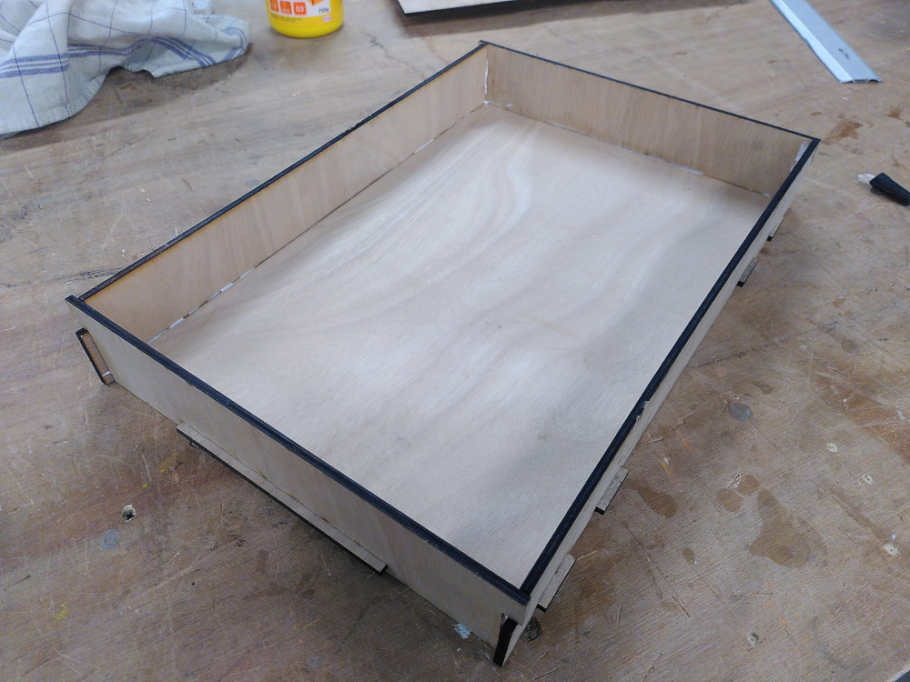

- Avant de serrer le tout au moyen de sert-joints, coller les parois externes. 
- Disposer les parois externes comme ceci (Attention à bien veiller à ce que les paroix externes soient disposé symétriquement): 
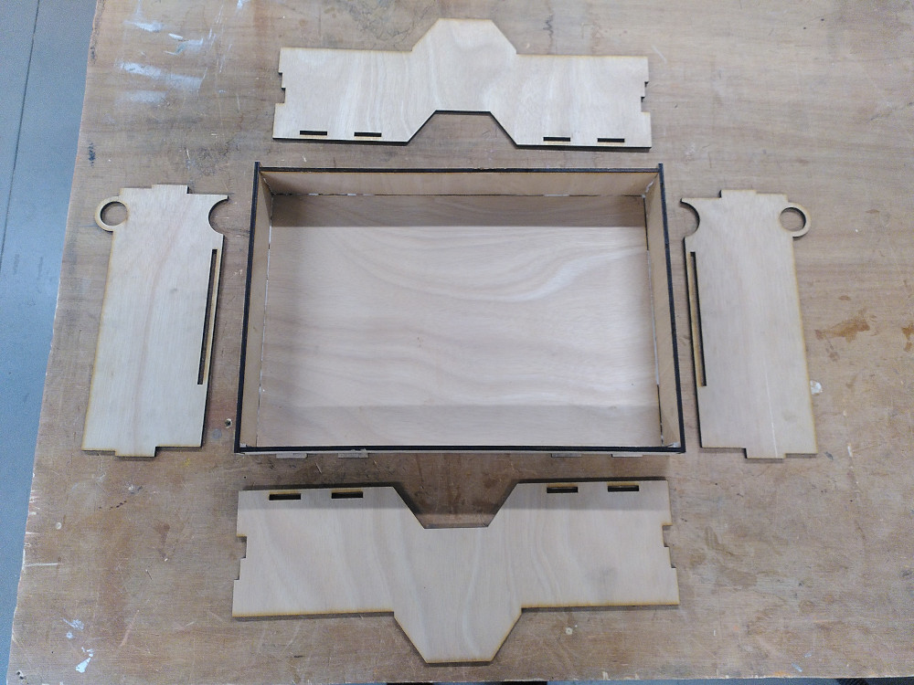

- Avant d'encoller, assembler à sec et marquer au crayon à papier les zones qu'il ne faudra pas encoller. 
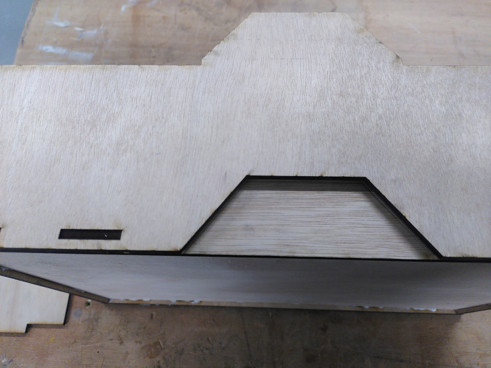

- Encoller les 4 faces une par une puis coller les cloisons extérieur.
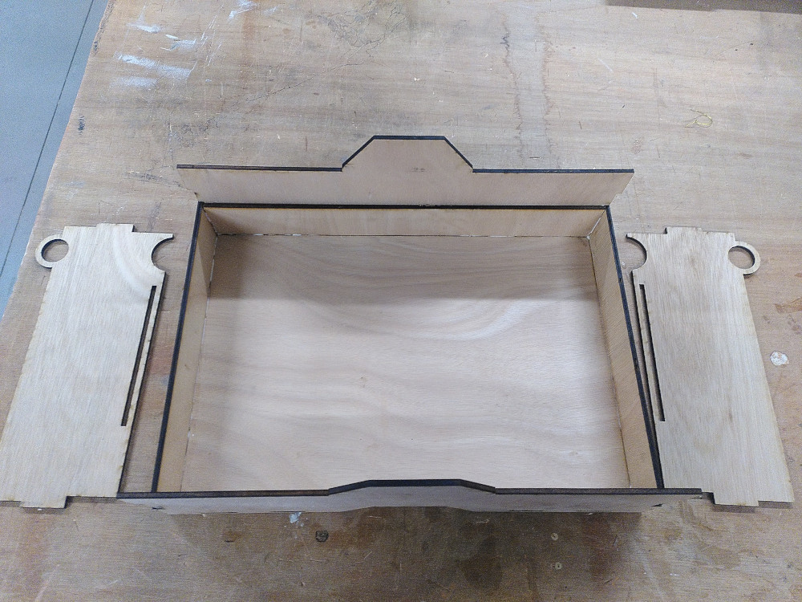
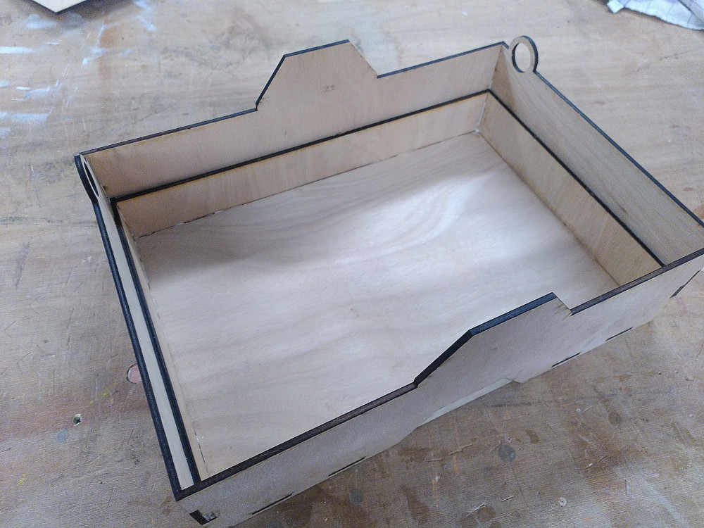

- Avant de poser les sert-joints, écarter les deux côtés pour insérer le couvercle.
- Serrer le tout avec des sert-joint et/ou des pinces. 
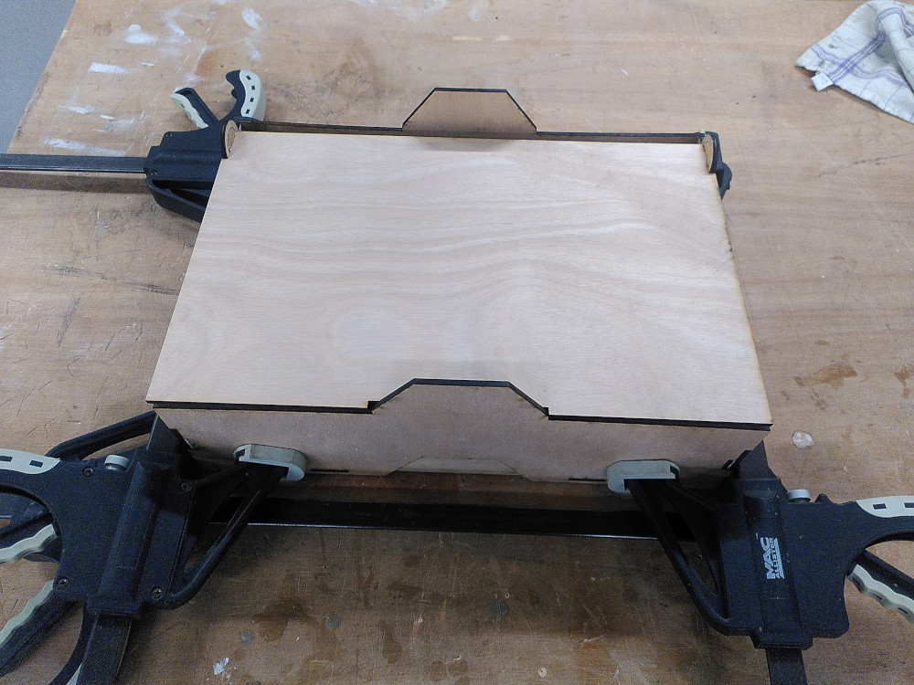

 

## 2. Modifier les côtes
Le modèle 3D est paramétrique, c'est à dire que toutes les dimensions du dessin sont calculés selon un ensemble de paramètres que l'on peut modifier (à la manière d'un tableur).

### 2.1 Prérequis
 - Bénéficier d'une licence fusion 360. [Autodesk propose une licence gratuite à dégradé pour usage personnel](https://www.autodesk.com/ca-fr/products/fusion-360/personal).
 - Retrouver le fichier ".f3d" déposé dans l'archive git au chemin : "3Dfiles/modifiable_fusion360"
 
### 2.2 Paramètres
Dans les fichiers 3d des boites d'amorce, il est possible d'agir sur : 

|Nom|Précisions|Notes|
|--|---------|------------|
|**Ep_bois**|Épaisseur des planches qui constitueront la boite|5mm recommandés mais il est possible d'utiliser du mdf et au quel cas ce sera plutôt 6mm|
|**Ep_fond**|Epaisseur de la planche du fond de la boite|Parfois pour contenir des objets lourds il peut-être utile de faire un fond plus épais comme 10mm par exemple.|
|**Pbx**|Profondeur extérieur de la boite||
|**Lbx**|Largeur extérieur de la boite||
|**Hbx**|Hauteur extérieur de la boite||

**Attention** : Pour rester empilable, 2 boites doivent avoir les mêmes dimensions? Seule la hauteur **Hbx** peut varier. 

### 2.3 Modifier les paramètres

 - Dans fusion 360, importer le fichier précédemment téléchargé. 
 - **Ouvrir la table des paramètres**: Dans le menu "Solide" dans le menu déroulant des outils "modifier", cliquer sur "modifier les paramètres"
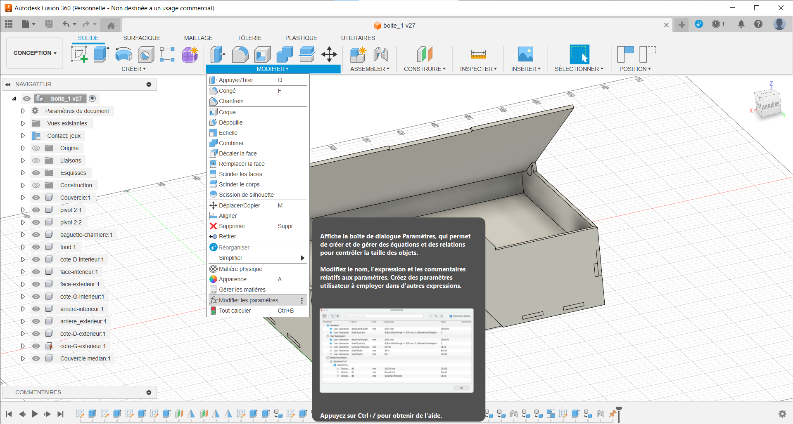

 - On obtient alors le tableau des paramètres. Toutes les cotes qui ont permis de déterminer les dimansions de cette boite, dépendent de ces 5 valeurs.
 - Pour modifier un paramètre, double-cliquer sur la valeur puis la modifier. Attention ! Ces valeurs sont en millimètre. 
 - Ne pas oublier que pour que des boites puissent s'empiler, leurs paramètres doivent être les même. Seul les hauteurs (Hbx) peuvent varier?
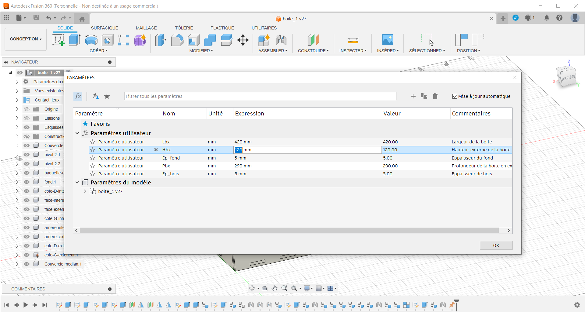

 - Ici on a simplement modifié la hauteur à 200mm. 
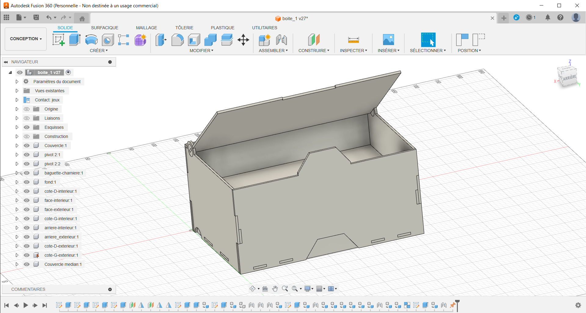

 - Pour importer les surfaces au format ".svg", il faut uiliser un pluggin de fusion. Que  l'on retrouve après installation dans le menu "Utilitaires".
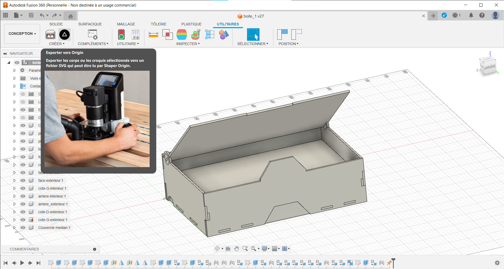

## X. Points à améliorer
 - Numéroter les pièces
 - Finir les fichiers .svg

